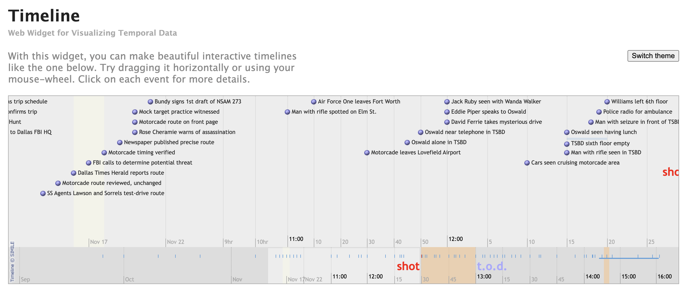
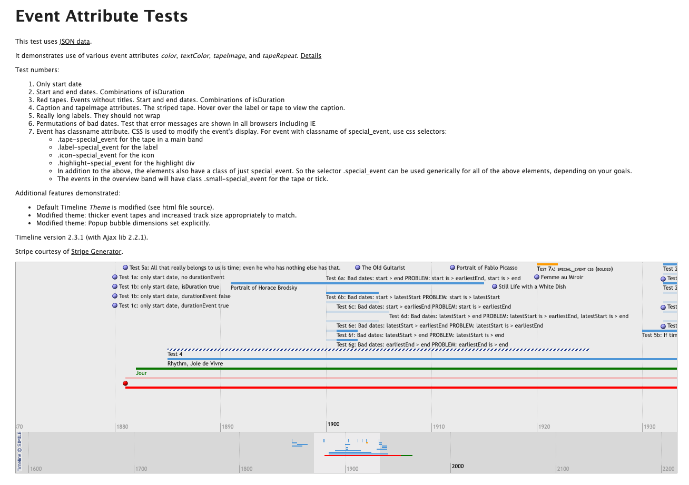
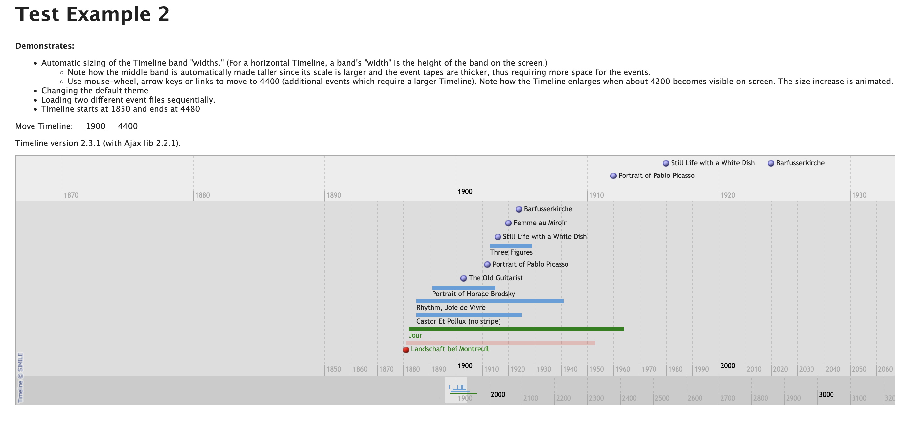

## Background
The original Simile Widgets Timeline project at MIT (https://www.simile-widgets.org/timeline/) was an advanced javascript visualization, known as “Google Maps for time”. The component relied upon legacy javascript libraries, including Jquery, but was never modernized to modern JS libraries like Angular, React or View. The purpose of this project is:
* Recreate the MIT Simile Timeline component as a modern React component that implements most or all of the features of the original MIT Simile Timeline component and is 100% compatible with loading legacy Simile JSON data.
* Create a new timeline portfolio website that includes demos of various timelines similar to the origial site (https://www.simile-widgets.org/timeline/). This should also include pointers to the source code on GitHub and the library on NPM
* Distribute and version the NPM library as a standalone component. Seperate out the demo site as a site that can be run and exececuted **USING THE COMPONENT** explicity and fully — not doing any rendering or timeline functions independent of the component.

## Immutable Requirements
The following requirements must be satisfied by the new component:
* Releasable as a NPM package as stand-alone component
* Demo portfolio that uses the NPM package directly and can be spun up as a seperate website
* Full GitHub site (license, support rules, docs) that supports community use of the component
* 100% Compatible with source JSON from original Simile Timeline
* High-performance Typescript for rapid and extensible rendering

## Project Requirements
The following requirements must be satisfied by the project:
* Strict seperation between the NPM project and the demo project — the demo must use the most current version (not published on NPM) of the NPM package / component
* Exetensive use of the Playwright libary and Playwright MCP server to test the application. This should result in an exstensive suite of E2E UI tests + a Playwright MCP agent that tests the screens as part of the build process, iterating with Claude Code to make sure the UI meets requirements.

## Technical Architecture
**Monorepo Structure:** pnpm workspaces

The project uses pnpm workspaces for package management and linking. This provides:
* Minimal configuration overhead
* Demo references library via `workspace:*` protocol — always uses local source during development
* Fast installs with efficient disk usage
* Seamless integration with Vite + TypeScript

```
/
├── pnpm-workspace.yaml
├── package.json                     # root workspace config
├── packages/
│   └── react-simile-timeline/       # NPM library (publishable)
│       ├── src/
│       └── package.json
└── demo/
    ├── src/
    └── package.json                 # depends on "react-simile-timeline": "workspace:*"
```

## Technical Decisions

| Decision | Choice | Notes |
|----------|--------|-------|
| **NPM Package Name** | `react-simile-timeline` | Confirmed |
| **React Version** | 18.x minimum | Current LTS, broad compatibility |
| **Styling** | Tailwind CSS | Utility-first, tree-shakeable |
| **Event Popup UI** | Floating tooltip | Start simple; use Playwright to explore original Simile behavior and adjust if needed |
| **Date/Time Handling** | UTC internal, local display | All dates stored/computed in UTC, rendered in user's local timezone |
| **Unit Testing** | Vitest | Fast, Vite-native, alongside Playwright E2E |
| **Mobile/Touch** | Low priority | Swipe pan, pinch zoom deferred to post-release or community contribution |

## Planning Requirements
The plan will be formulated by Claude but must, at a mimum, follow the structure below:
* Standup of minimum viable component and demo, including Playwright tests and use of MCP. The demo must use the current React / NPM component and explain how it does it.
* A series of sprints that introduce increasing compatibility with Simile Timeline features. Each sprint will have a sprint showcase, demoing the new features. The showcase will have corresponding Playwright scripts to execute the showcase functions
* A series of pre-release sprints to publish the demo site to Vercel, publish the library to NPM site and to make sure the GitHub library is fully ready for consumption by the open source community.

## Reference Materials
The following resources serve as **reference only** — this project starts fresh from scratch:
* [Source code from the original Simile Timeline](https://github.com/simile-widgets/ancient-simile-widgets/tree/master/timeline) - Original MIT implementation for feature reference
* [Source code from a similar project that attempted to replatform to React](https://github.com/thbst16/react-simile-timeline) - Previous React attempt, useful for understanding challenges

## Testing Infrastructure
Testing setup is part of this project's scope. The implementation will include:

**Vitest (Unit Tests):**
* Core logic testing (date parsing, layout engine, event filtering)
* Component unit tests with React Testing Library
* Fast, Vite-native test runner

**Playwright (E2E Tests):**
* Full Playwright test suite installation and configuration
* Playwright MCP server integration for Claude Code interaction
* E2E test coverage for all timeline features
* Visual regression testing for UI consistency
* Cross-browser testing (Chrome, Firefox, Safari, Edge)

## Deployment
Demo site deployment via standard Vercel setup with no special configuration requirements.

---

## CLAUDE.md Rules

The following rules will be written to `.claude/CLAUDE.md` during Sprint 0:

### MUST DO

**Architecture:**
- Library code lives ONLY in `packages/react-simile-timeline/`
- Demo code lives ONLY in `demo/`
- Demo MUST import from `react-simile-timeline` package, never relative paths to library source
- All timeline rendering logic MUST be in the library — demo is purely consumption/showcase

**Data Compatibility:**
- MUST maintain 100% backward compatibility with Simile JSON format
- MUST support all documented event fields (`start`, `end`, `title`, `description`, `color`, `textColor`, `icon`, `classname`, etc.)
- MUST handle all date formats (ISO 8601, legacy strings, BCE dates)

**Testing:**
- All new features MUST have corresponding Playwright E2E tests
- Core logic (date parsing, layout engine) MUST have Vitest unit tests
- Use Playwright MCP to verify UI matches design specifications

**Code Quality:**
- TypeScript strict mode — no `any` types without explicit justification
- All public APIs MUST have JSDoc comments and exported types

### MUST NOT DO

**Architecture:**
- NEVER put rendering logic in the demo — it only consumes the component
- NEVER import demo code from the library
- NEVER bypass pnpm workspace protocol for local development

**Dependencies:**
- NEVER add dependencies to the library without explicit approval
- NEVER bundle React — it's a peer dependency
- NEVER include Tailwind runtime in library bundle (use CSS variables/classes for theming)

**Compatibility:**
- NEVER make breaking changes to Simile JSON schema support
- NEVER change the public API without updating types and docs

**Scope:**
- NEVER create features not explicitly defined in the sprint plan or requested by the user
- NEVER embellish or "improve" beyond stated requirements — implement exactly what is specified
- NEVER add "nice to have" enhancements without explicit approval

**Git:**
- NEVER commit changes until the user explicitly requests a commit
- NEVER push to remote without explicit instruction

---

## Simile JSON Data Format

The component must be 100% compatible with legacy Simile Timeline JSON. Below is the documented schema:

### Root Structure
```json
{
  "dateTimeFormat": "iso8601",
  "events": [ /* array of event objects */ ]
}
```

### Event Object Fields

| Field | Type | Required | Description |
|-------|------|----------|-------------|
| `start` | string | **Yes** | Start date/time (ISO 8601 or parseable date string) |
| `title` | string | **Yes** | Display title of the event |
| `end` | string | No | End date/time (for duration events) |
| `description` | string | No | Longer description, can include HTML |
| `isDuration` | boolean | No | Explicitly mark as duration event (also inferred if `end` present) |
| `durationEvent` | boolean | No | Alias for `isDuration` (legacy compatibility) |
| `color` | string | No | Background color for event marker/tape (hex or CSS color) |
| `textColor` | string | No | Text color for event label |
| `icon` | string | No | URL to custom icon image |
| `image` | string | No | URL to event image |
| `link` | string | No | URL for "more info" link |
| `caption` | string | No | Caption text (shown on hover) |
| `classname` | string | No | CSS class name for custom styling |
| `tapeImage` | string | No | URL to pattern image for tape fill |
| `tapeRepeat` | string | No | CSS background-repeat value for tape |
| `trackNum` | number | No | Track number for positioning |

### Example Event Data
```json
{
  "dateTimeFormat": "iso8601",
  "events": [
    {
      "start": "1963-11-22T12:30:00",
      "title": "JFK Assassination",
      "description": "President Kennedy shot in Dallas, Texas",
      "color": "#c41e3a",
      "icon": "https://example.com/icon.png"
    },
    {
      "start": "1961-01-20",
      "end": "1963-11-22",
      "title": "Kennedy Presidency",
      "description": "John F. Kennedy serves as 35th President",
      "isDuration": true,
      "color": "#4a90d9"
    }
  ]
}
```

### Date Format Support
The component should support multiple date formats for maximum compatibility:
* ISO 8601: `2023-01-15`, `2023-01-15T10:30:00`, `2023-01-15T10:30:00Z`
* Legacy formats: `Jan 15 2023`, `January 15, 2023`
* Year only: `2023` (interpreted as Jan 1)
* Negative years for BCE: `-500` (500 BCE)

---

## UI Design Specification

The following detailed specifications are derived from analysis of the original Simile Timeline screenshots.

### Screenshot 1: JFK Timeline (Default Multi-Band View)


**Key Features Demonstrated:**
* **Multi-band synchronized timeline** - Two bands with different zoom levels scrolling together
* **Upper band (detail):** Shows individual events with labels, time scale in hours/minutes
* **Lower band (overview):** Compressed view with tick markers, time scale in days/months
* **Event markers:** Colored circular dots preceding text labels
* **Hot zones:** Highlighted time periods (peach/orange shading) with text annotations ("shot", "t.o.d.")
* **Smart label layout:** Events stacked vertically to prevent text overlap
* **Theme switcher:** Button in top-right corner
* **Branding:** "Timeline © SIMILE" in bottom-left

### Screenshot 2: Event Attribute Tests


**Key Features Demonstrated:**
* **Point events:** Single-date events with dot markers and labels
* **Duration events:** Horizontal bars/tapes representing time spans
* **Event styling attributes:**
  - `color` - Custom event colors (red, blue, green, etc.)
  - `textColor` - Custom label text colors
  - `tapeImage` - Striped/patterned tape fills
  - `tapeRepeat` - Pattern repetition control
  - `classname` - CSS class for custom styling
* **CSS selectors for customization:**
  - `.tape-special_event` - tape in main band
  - `.label-special_event` - event label
  - `.icon-special_event` - event icon
  - `.highlight-special_event` - highlight div
  - `.small-special_event` - overview band elements
* **Long labels:** Text should not wrap, truncate appropriately
* **Error handling:** Graceful handling of invalid date ranges

### Screenshot 3: Test Example 2 (Three-Band Configuration)


**Key Features Demonstrated:**
* **Three synchronized bands** at different zoom levels:
  - Top: Decade-scale overview (compact)
  - Middle: Year-scale detail with event tapes (main view)
  - Bottom: Century-scale overview
* **Automatic band height sizing:** Bands grow/shrink based on content density
* **Duration event visualization:** Colored horizontal bars (blue, green, red, pink)
* **Same events rendered differently per band:** Detail vs. simplified markers
* **Animated transitions:** Timeline smoothly expands when more events come into view
* **Navigation controls:** "Move Timeline" links for jumping to specific dates
* **Multiple data sources:** Can load events from different JSON files sequentially

---

## Feature Prioritization

Features are categorized by priority level based on screenshot analysis:

- **Critical** = Screenshot 1 features (default JFK timeline view) — core MVP functionality
- **High** = Screenshots 2 & 3 features (event attributes, multi-band, duration events)
- **Non-Functional** = Performance, compatibility, accessibility — woven throughout sprints
- **Non-Critical** = Nice-to-have features, polish, advanced customization

**Priority Order:** Critical > High > Non-Critical (Non-Functional integrated throughout)

### Critical Features (Screenshot 1 - MVP)
| Feature | Description |
|---------|-------------|
| Multi-band layout | Two synchronized bands (detail + overview) |
| Band synchronization | Linked scrolling across all bands |
| Horizontal pan | Click-drag to scroll timeline |
| Time scale labels | Date/time labels appropriate to zoom level |
| Point events | Single-date events with colored dot marker + label |
| Event labels | Text labels for events |
| Smart label layout | Vertical stacking to prevent text overlap |
| Overview band markers | Simplified tick marks in compressed band |
| Classic theme/styling | Default Simile visual appearance |
| Event click popup | Click event to show details/description |
| Simile JSON format | Load events from legacy Simile JSON |
| URL data source | Fetch events from JSON URL |
| Inline data prop | Pass events directly as component props |

### High Features (Screenshots 2 & 3)
| Feature | Description |
|---------|-------------|
| Hot zones | Highlighted time regions with background shading |
| Hot zone annotations | Text labels within hot zones ("shot", "t.o.d.") |
| Mouse wheel zoom | Scroll to zoom in/out on timeline |
| Duration events | Start/end date events as horizontal tapes/bars |
| Event colors | Custom `color` attribute per event |
| Text colors | Custom `textColor` attribute |
| Tape images | Striped/patterned fills via `tapeImage` |
| CSS classnames | Custom CSS classes via `classname` attribute |
| Three-band configuration | Support for 3+ synchronized bands |
| Auto band height sizing | Bands grow/shrink based on content density |
| Animated transitions | Smooth expansion when events come into view |
| Navigation controls | Jump-to-date links/controls |
| Multiple data sources | Load and merge events from multiple JSON files |

### Non-Functional Requirements
| Requirement | Target | Integration |
|-------------|--------|-------------|
| Rendering performance | 60 FPS smooth scrolling | Sprint 1+ |
| Large dataset support | >1000 events without degradation | Sprint 2 |
| Legacy JSON compatibility | 100% compatible with Simile JSON | Sprint 1 (Critical) |
| NPM package size | <100KB gzipped | Sprint 4 |
| Accessibility (WCAG 2.1) | Keyboard nav, ARIA labels, screen reader | Sprint 2+ |
| TypeScript exports | Full type definitions for all APIs | Sprint 1+ |
| Browser compatibility | Chrome, Firefox, Safari, Edge (latest 2) | Sprint 1+ |

### Non-Critical Features
| Feature | Description |
|---------|-------------|
| Dark theme | Dark mode color variant |
| Custom themes | User-defined theme objects |
| Zone magnification | Optional zoom effect in hot zones |
| tapeRepeat attribute | Pattern repetition control for tape images |
| Theme switcher UI | Built-in theme toggle component |
| Graceful error handling | Handle invalid date ranges without crash |
| Branding/watermark | "Timeline © SIMILE" optional display |

---

## Acceptance Criteria

All sprint deliverables must meet the following criteria to be considered complete:

| Criteria | Requirement |
|----------|-------------|
| **Visual Fidelity** | UI must closely match the reference screenshots — layout, spacing, colors, typography should be visually consistent with original Simile Timeline |
| **Performance** | 60 FPS smooth scrolling, no jank during pan/zoom, responsive interactions |
| **Test Coverage** | All features must have passing Playwright E2E tests; core logic must have Vitest unit tests |
| **TypeScript** | No type errors, all public APIs fully typed |
| **Build** | Clean build with no warnings, library exports correctly |

## Design Decisions (Delegated)

The following design decisions will be made during Sprint 0 and documented in `docs/API.md`:

- **Component API** — Props structure, band configuration approach, event handlers
- **Theme Structure** — CSS variables, theme object shape, customization approach

These will be designed to maximize developer experience while maintaining Simile compatibility.

---

## Sprint Plan

### Sprint 0: Foundation
**Objective:** Project scaffolding, tooling, test infrastructure, and project documentation

**Deliverables:**

*Project Structure:*
- [ ] pnpm workspace monorepo structure
- [ ] `packages/react-simile-timeline/` - Vite library setup with TypeScript
- [ ] `demo/` - Vite React app consuming workspace package
- [ ] Sample Simile JSON data files for testing

*Project Documentation:*
- [ ] `.claude/CLAUDE.md` - Project-specific rules and instructions (see CLAUDE.md Rules section)
- [ ] `docs/PRD.md` - Product Requirements Document (derived from this project-background)
- [ ] `docs/SPRINT_PLAN.md` - Sprint plan with deliverables and acceptance criteria
- [ ] `docs/API.md` - API design document (component props, types, examples)
- [ ] Root `README.md` - Project overview, quick start, links to docs

*Tooling & Config:*
- [ ] ESLint + Prettier configuration
- [ ] TypeScript configuration (tsconfig.json)
- [ ] Tailwind CSS setup for both library and demo
- [ ] Vite configuration for library build (ESM + types)

*Testing Infrastructure:*
- [ ] Vitest installation and configuration
- [ ] Playwright installation and configuration
- [ ] Playwright MCP server integration
- [ ] Basic CI pipeline (lint, type-check, test)

**Playwright Tests:**
- Verify demo app loads
- Verify library imports correctly

**Vitest Tests:**
- Basic smoke test for library export

---

### Sprint 1: Critical Features (MVP)
**Objective:** Core timeline matching Screenshot 1 functionality

**Deliverables:**
- [ ] `<Timeline>` component with configurable bands
- [ ] Two-band layout (detail + overview)
- [ ] Band synchronization (linked scrolling)
- [ ] Horizontal pan (drag to scroll)
- [ ] Time scale rendering with appropriate labels
- [ ] Point event rendering (dot + label)
- [ ] Smart label layout engine (vertical stacking)
- [ ] Overview band with tick markers
- [ ] Classic theme implementation
- [ ] Event click handler with popup/details display
- [ ] Simile JSON data loading (URL + inline)
- [ ] TypeScript types for all public APIs

**Non-Functional (integrated):**
- 60 FPS scroll performance baseline
- 100% Simile JSON compatibility for point events
- Basic keyboard navigation (arrow keys to pan)

**Playwright Tests:**
- Timeline renders with sample data
- Pan interaction works
- Events display correctly
- Click popup appears
- Band synchronization verified
- Label overlap prevention verified

**Demo Showcase:**
- JFK timeline recreation matching Screenshot 1

---

### Sprint 2: High Features (Enhanced)
**Objective:** Duration events, hot zones, zoom, advanced styling

**Deliverables:**
- [ ] Duration events (horizontal tape/bar rendering)
- [ ] Hot zones (highlighted background regions)
- [ ] Hot zone text annotations
- [ ] Mouse wheel zoom
- [ ] Event `color` attribute support
- [ ] Event `textColor` attribute support
- [ ] Event `classname` attribute for CSS customization
- [ ] Auto band height sizing
- [ ] Three-band configuration support

**Non-Functional (integrated):**
- Large dataset optimization (>1000 events)
- ARIA labels and roles
- Keyboard zoom controls

**Playwright Tests:**
- Duration events render as tapes
- Hot zones display with correct styling
- Zoom in/out functions correctly
- Custom colors apply to events
- Three bands synchronize correctly

**Demo Showcase:**
- Event Attribute Tests page (Screenshot 2 features)
- Three-band example (Screenshot 3 features)

---

### Sprint 3: Non-Critical + Polish
**Objective:** Advanced features, theming, edge cases

**Deliverables:**
- [ ] Tape images (`tapeImage` attribute)
- [ ] `tapeRepeat` attribute
- [ ] Dark theme
- [ ] Custom theme support (user-defined theme objects)
- [ ] Theme switcher UI component
- [ ] Zone magnification effect (optional)
- [ ] Navigation controls (jump-to-date)
- [ ] Multiple data source loading/merging
- [ ] Animated transitions on content change
- [ ] Graceful error handling for invalid dates
- [ ] Optional branding/watermark

**Non-Functional (integrated):**
- Full WCAG 2.1 AA compliance audit
- Screen reader testing
- Performance profiling and optimization

**Playwright Tests:**
- Theme switching works
- Tape images render correctly
- Navigation controls function
- Multiple data sources merge correctly
- Animations are smooth
- Accessibility audit passes

**Demo Showcase:**
- Full-featured demo with all options
- Theme switcher demonstration
- Performance stress test with large dataset

---

### Sprint 4: Release Readiness
**Objective:** Production-ready NPM package, demo site, GitHub presence

**NPM Package:**
- [ ] Package.json metadata (name, description, keywords, repository)
- [ ] Proper exports configuration (ESM, CJS, types)
- [ ] Bundle size optimization (<100KB gzipped target)
- [ ] README.md with installation, quick start, API reference
- [ ] CHANGELOG.md
- [ ] LICENSE (MIT)
- [ ] NPM publish workflow (GitHub Actions)
- [ ] Semantic versioning setup

**Demo Site (Vercel):**
- [ ] Production build optimization
- [ ] Vercel deployment configuration
- [ ] Custom domain setup (if applicable)
- [ ] SEO meta tags
- [ ] Landing page with feature overview
- [ ] Multiple demo timelines showcasing features
- [ ] Links to GitHub and NPM
- [ ] Usage documentation/examples

**GitHub Repository:**
- [ ] README.md (badges, features, installation, examples)
- [ ] CONTRIBUTING.md
- [ ] CODE_OF_CONDUCT.md
- [ ] Issue templates (bug report, feature request)
- [ ] Pull request template
- [ ] GitHub Actions CI/CD (test, build, publish)
- [ ] GitHub Pages or link to Vercel demo
- [ ] Release workflow with auto-generated notes

**Final Testing:**
- [ ] Full Playwright E2E suite passes
- [ ] Visual regression baseline established
- [ ] Cross-browser testing (Chrome, Firefox, Safari, Edge)
- [ ] Mobile/responsive testing
- [ ] Performance benchmarks documented

**Playwright Tests:**
- All previous tests pass
- Production build works correctly
- No console errors in demo
- All demo pages accessible

---

## Sprint Summary

| Sprint | Focus | Key Outcome |
|--------|-------|-------------|
| Sprint 0 | Foundation | Monorepo + Playwright + CI |
| Sprint 1 | Critical (MVP) | Working timeline matching Screenshot 1 |
| Sprint 2 | High Features | Duration events, hot zones, zoom, 3-band |
| Sprint 3 | Polish | Theming, advanced features, accessibility |
| Sprint 4 | Release | NPM publish, Vercel deploy, GitHub ready |